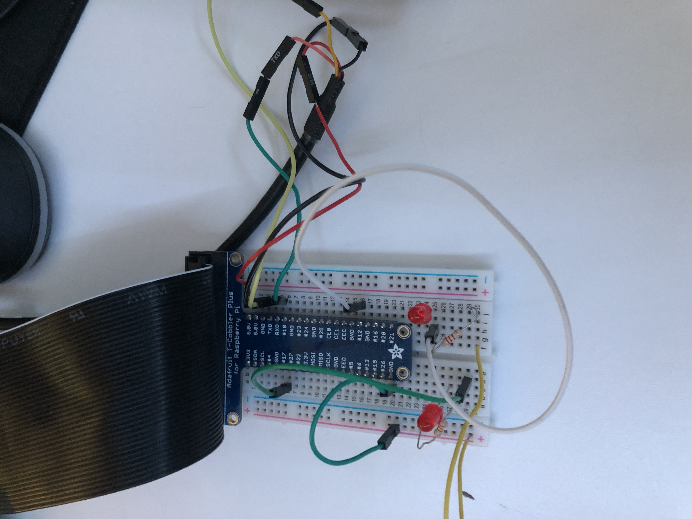
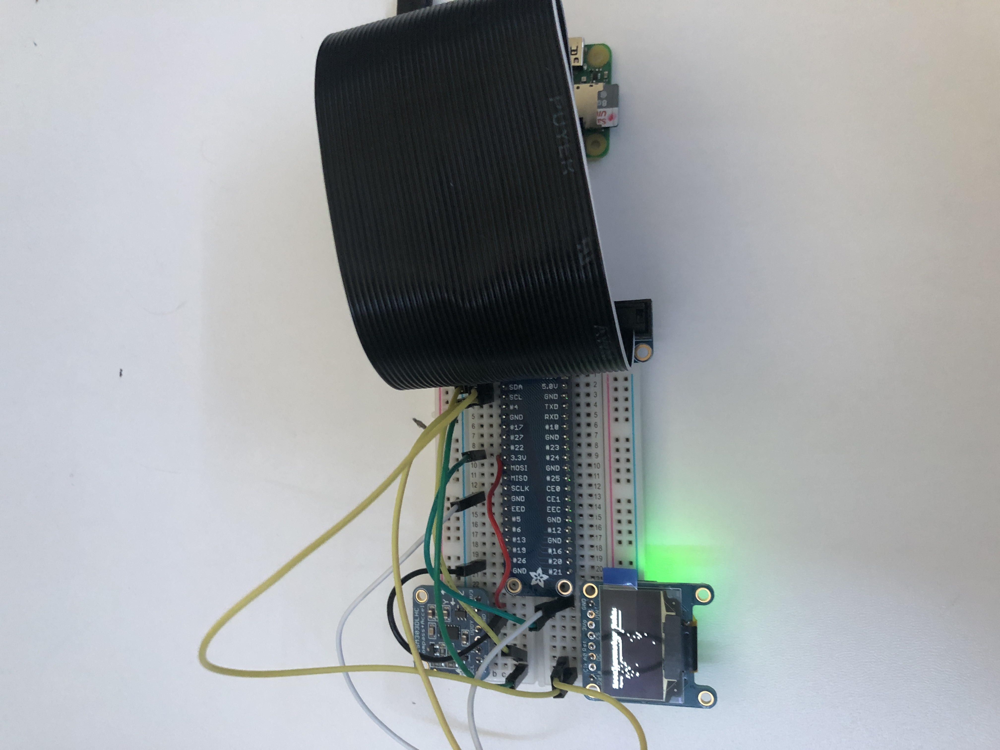

# Engineering 4 Notebook
My Engineering 4 Notebook - Get well soon Virgil van Dijk

Also my 4th engineering notebook, its fun to count. Please enjoy reading my occasional saracastic and/or informal remarks as I venture in the kinda weird and sometimes annoying but also cool world of modern technology. I'm also doing this whole thing from home because Coronavirus is happening as I'm sure you've heard, or heard about since you're reading this from the future when you can be near people and stuff. Anyways, enjoy.

Yes also, currently Virgil Van Dijk is hurt because Jordan Pickford decided it was a good idea to tear Mr. Van Dijk's ACL. 

## Introductory Raspberry Pi Assignments

### Hello Raspberry Pi

#### Description:

This is is Hello Raspberry Pi module. In this module, we connect the Raspberry Pi to our computer, and open the editor, in this case, Beagle Term. Then we had to make a basic program.

#### Code Link:

[Hello Raspberry Pi Code](https://github.com/glenert41/Engineering_4_Notebook/blob/main/Python/hello_world.py)

#### Images:

                                                                               

#### Reflection:

This module took 7 hours, although it was very easy. My issue was that when I open Beagle Term and hit enter, I do not get any response. The solution was to switch my TX and RX cables, as the label on them was incorrect.

### Get Your Pi Online

#### Description
This is the Get your Pi Online module. In this module, we had to connect our Pi to the internet, and then add the file from the Hello Raspberry Pi module to our Git Hub. We created folder on the Pi for our Engineering 4 Notebook Repo, and then we committed and pushed the file and folder to our Git Hub.

#### Code Link

N/A

#### Images

                                     
                             
#### Reflection
                      
This module took a bit of thinking and genuinely was difficult at times; the biggest take away for me was that you should not just type in what Dr. Shields has in the video, you should understand what each line, and really each word, does, as Beagle Term and Raspberry Pi can be unforgiving for learners like me. Also, when pushing to master, you may have to type main --- (git push origin master) or (git push origin main)

                                     
                                     
                                     
                                     
                                     
                                     
### Hello Python (Dice Roller)

#### Description
This is from the Hello Python module. In this module, we had to create a python file that would roll a die when enter was pressed, and when x was pressed, the program would quit.

#### Code Link

[Dicer Roller Code Link](https://github.com/glenert41/Engineering_4_Notebook/blob/main/Python/dice_roller.py)

#### Images

#### Reflection

This module was definitely the most challenging to date. It really made me rely on the skills I developed in the prior assignments. I think, as mentioned in the previous module, that going back throught the assignment video and watching/noting what each line does really helped. The hard part for me wasn't writing the actual code, but rather manuvering through the Raspberry Pi interface; however I think I have the basics down now. On issue I had was how to detect if enter was pressed with an input, the way to solve this is by leaving the quotes blank in between. For example, instead of ("ENTER") just do (" ")

### Program 01 - Calculator

#### Description

In this module, we had to make a calculator in python. Essentially, we had to have the user input 2 numbers, then run those numbers through one function, and recieve the results of the 5 different operators (Addition, Subtraction, Multiplication, Division, Modulo)

#### Code Link

[Calculator Link](https://github.com/glenert41/Engineering_4_Notebook/blob/main/Python/calculator.py)

#### Images

#### Reflection

This module was very fun for me. At first, I went through and didn't use a function (Which cost me a class period of work because I didn't fully read the directions. Life lesson 1 -- read the directions.) Anyways, my biggest takeaway from this module was really reafirriming how to use functions in python with parameters. Essentially, in the function definition, you have to declare that this function will need parameters (values) in order to run, and then it will use those values you give the function when you call it later on to give you the result.

### Program 02 - Quadratic Solver

#### Description

In this module, we had to make a quadratic solver, meaning the user would give their a,b, & c values for standard form of a quadratic, and then the program would produce the roots, and if there were no roots, then the program would produce that there were no roots.

#### Code Link

[Quadratic Solver Link](https://github.com/glenert41/Engineering_4_Notebook/blob/main/Python/quadratic_solver)

#### Images

#### Reflection

This module was pretty straight forward. It was cool to see the power that arrays had, and I definitely plan to use them in the future. The hardest part for me though was getting used to arrays. You can print the values of the array, and even print the array, but there will still be brackets around the values. In this case, you have to place a string of the value of each position in the array. Something that I thought was cool though is that you are able to mix numbers and letters in an array, which lets you store different types of values in one array. Also, if you want to add a value to an array, you have to add append it (ARRAYNAME.append("value")).

### Program 03 - Strings and Loops (String Splitter)

#### Description

In this module, we had to make a program that would take an input sentence, and then print the input out letter by letter, and with a - sign instead of a space.

#### Code Link

[String Splitter](https://github.com/glenert41/Engineering_4_Notebook/blob/main/Python/Strings_and_Loops.py)

#### Images

#### Reflection

There were plenty of different ways to do this module. I began with roughly 10 lines of code. Then broke it down in to smaller and more concise lines, until I was able to have around 5 remain. I think my favorite way of printing items in a list is by doing this doing  print(*LIST_NAME, sep='\n').* This was seemingly the most efficient way to print each element on its own line. You could also do something with a for loop, like as follows .... for X in LISTNAME: print(x) ... This works well when you have other operations to do in the for loop. I expect to be using the later in the upcoming module. Also, in order to replace an item in the list, just use the replace() function. For example ... stringName = stringName.replace("w", "t")  ... This replaces all w's in the list with t's.
 
 
 
 
 ### Program 04 - Man Shaped Piñata
 
 
 #### Description
 
In this assignment, we had to recreate the classic game Hangman; or as we're going to call it, Man-Shaped Piñata. The game is simple, one player inputs a word, and another player has to guess the other player's word, by guessing lettter by letter. If the 2nd player guesses an incorrect letter, the program will draw a part of Franklin the Turtle without his shell; and you don't want to see Franklin the Turtle without his shell now don't you...?
 
 #### Code Link
 
 [Man Shaped Piñata](https://github.com/glenert41/Engineering_4_Notebook/blob/main/Python/msp.py)
 
 #### Images
 
 
 
 
 
 #### Reflection
 
 This assignment was the first assignment this year to really make me think about the process of the assignment. At first, it was really daunting to create the game, but I ended up breaking the assignment down in to 3 different phases (1: Get the user input, create an array with those letters, and then create an array with the same amount of underscores as the length of the input 2: Get the program fully functioning, without the MSP image. 3: Add to the MSP Image after every missed letter. The most difficult part for me was testing whether or not the letter was in the list/array. In order to overcome this, it is acutally quite simple, you can just use the "in" or "not in" feature in python. (Something like this....      if ELEMENT in LIST:   or if ELEMENT not in LIST)
 

## GPIO Stuff and Whatnot

### GPIO Pins SSH

#### Description:

In this module, we had to use SSH to be able to remotely activate the led. I decied to do this assignment first as it seemed to be the most straightforward.

#### Code Link:

[SSH Code](https://github.com/glenert41/Engineering_4_Notebook/blob/main/Python/led_blink.py)

#### Images:

Image Credit: Owen McKenney
                                                                               

#### Reflection:

This module was relatively straight forward. Setting up the SSH shouldn't cause you many problems at all. The hardest part to understand is that there is a difference between the GPIO pins and the physical pins. In the code, you program it to the physical pins. In the code, it should be more evident about what I am saying, as the comments should clear it up. In classic Graham Lenert fasion, the reason my LED wasn't blinking was because my LED was not in correctly, the legs of the LED were reversed. Here is a link to the GPIO map I referenced, you can also use the TCobbler thing, but I like this more. 

[GPIO PinOut Map Thing](https://i2.wp.com/peppe8o.com/wp-content/uploads/2020/09/Raspberry-PI-Zero-Pinout-schema.jpg?resize=910%2C657&ssl=1)
 
 
 
 
 
 ### GPIO Pins Python
 
 #### Description
 
 Well, this is the same thing as the GPIO pins SSH, but without the SSH part. So, It was very easy, as I had already done the SSH. Essentially, we wanted to make an LED (or two) blink using Python and GPIO pins. 
 
 
 #### Code Link
 
 [SSH Code](https://github.com/glenert41/Engineering_4_Notebook/blob/main/Python/led_blink.py)
 
 
Quick little disclaimer: this is the same code and image as the SSH Pins module. This only includes one LED, but all you would have to do is add the port to the LEDS list, and wire another LED up.
 
 
 #### Image
 

Image Credit: Owen McKenney

#### Reflection

Once again this was the same module as the SSH regarding the actual code and wiring. Just make sure you're referencing the PinOut (linked below) and you're LED is wired correctly. The set up process is very similar to Arduino and every other language, where you have to assign the pin you want, then set it to an output, then set the output to high.

[GPIO PinOut Map Thing](https://i2.wp.com/peppe8o.com/wp-content/uploads/2020/09/Raspberry-PI-Zero-Pinout-schema.jpg?resize=910%2C657&ssl=1)
 
 
 
 
 
### GPIO Pins - Bash

#### Description

In this assignment, we had to make an LED blink 10 times using bash. That's about it.

#### Code Link

[LED Blink Bash Code](https://github.com/glenert41/Engineering_4_Notebook/blob/main/Bash/led_blink_bash)

#### Image

Image Credit: Owen McKenney

#### Reflection

This module was a bit tricker than the previous ones, even if the idea behind it was very straightforward. This module took quite a bit of research, and I have linked two different websites that walked me through it below. The hardest part was understanding what lines you needed, and what lines did. Firstly, I used the "touch" command from the first link below in order to create my bash file. Also, I created a new folder for my bash scripts. Next, you had to do some weird stuff. That being, essentially allowing you to run the file by just typing the name of it. The first link below once again explains that well. The second link below is really where the majority of the information for the assignment came from. In order to toggle (turn on or off) the led with bash, you need to have a line that establishes the GPIO, then says physical pin, then says you want to toggle it, then the physical pin you want. That crucial line is shown in the 2nd link below, as well as on my code linked above.

[General Bash Code Stuff](https://www.taniarascia.com/how-to-create-and-use-bash-scripts/)

[How to make an LED Blink with Bash](https://www.teknotut.com/en/first-raspberry-pi-project-blink-led/#Blink_Project)

### Hello Flask

#### Description
In this module, we had to set up our raspberry pi to be a web server that you can access by just typing the ip address in to a web browser.

#### Code Link

[Hello Flask Code](https://github.com/glenert41/Engineering_4_Notebook/blob/main/Python/Flask/hello_world/app.py)

This is the same code that is given to you in the assignment module

#### Reflection

This assignment we generally pretty straightforward with little room for error relative to the GPIO modules. One quick side note though, you have to be running the app.py program for the web server to be accessible. When you run the "sudo python app.py", and your pi stops responding and goes blank, that is when you can access the web server, and then you've just got to click ctrl+c to stop the web server. 

### I2C 

#### Description

In this assignment, we had to use a OLED screen and an accelerometer; we took the acceleration values from the accelerometer, and then showed those values on the screen. Relatively straightforward on paper.

#### Code Link

[I2C Code](https://github.com/glenert41/Engineering_4_Notebook/blob/main/Python/i2c.py)

#### Images

I haven't included images here, as the wiring is generally pretty straightforward and very well detailed in the module, and an image of my cluster of wires would likely be detrimental to your success. My advice here though is make sure to use the Cobbler, it makes wiring the SDA and SCL much easier.

#### Reflection

This was definitely this most difficult assignment to date. There were quite a few different things we had to pick up and apply. That being said, I would strongly, I mean like your life depends on it strongly, recommened looking at the code from the two examples that we ran before we were let loose on the assignment. I've linked a github link for them below, so you don't have to look at them on your pi. There is a better explanation of the module in the comments in my code, but you can essentially take most of the stuff you'll need for this assignment from those two examples. The part that really grinded my gears (Do people still say "Grinded my Gears?" Well I just did) anyways, I was having issues with the .read() for my accelerometer. According to the people that helped me, the accelerometer gives you 6 data points, so you need to assign those 6 data points to values, or else you get a silly little error; Essentially, you can't do what I tried, and only assign the acceleration values, you also need to assign the mag values, even if you don't use the mag values. Then everything should be sunny in the world of the I2C assignment. Oh and also, when you use the .format(), you can still edit the values in the parenthesis. I mean that you can do stuff like this .format(round()), and that should help you scale the values down to where you want.

[OLED Screen](https://github.com/adafruit/Adafruit_Python_SSD1306/blob/master/examples/shapes.py)

[Accelerometer](https://github.com/adafruit/Adafruit_Python_LSM303/blob/master/examples/simpletest.py)

### GPIO Flask

#### Description

In this assignment, we had to make a user interface to run on a Raspberry Pi webserver, which would control two LEDS; allowing you to turn them on and off, using 4 buttons.

#### Code Link

[GPIO Flask Folder](https://github.com/glenert41/Engineering_4_Notebook/tree/main/Python/Flask/gpio)

#### Images

#### Reflection

This was one of those assignments that you don't like doing because it is hard to figure out, and then once you figure it out, it becomes pretty fun. The most difficult thing for me was sorting out how to differentiate between the two different buttons. I'm still not entirely sure how I did it, but I essentially gave each button a name, class, and value, that was numbered. The class was for CSS, and the name and value were used to differentiate the buttons in the python file. For the rest of the index.html file, I would want you to know that there are 5 different button editing areas. At the top, there is the button{} area. Here, you'll make changes that will apply to every button on your screen. For the individual buttons areas, which I didn't really need to use, which are .btn{} and so on, you can make changes to that specific button, without altering the other buttons.

For the python part of it, that definitely took a little while to figure out. The code should be pretty straightforward, and that was the easiest way I could find to differentiate the buttons. You don't need to prind the button name like I did in each if statement, but I just did that to make it more obvious which button you were pressing. 

### Headless

#### Description

In this assignment, we had to take data from an accelerometer, then graph is visually on our OLED Screen. We then had to be able to remotely operate/run the program; either by having the program run on startup, or be able to SSH in to the pi to run the program. 

#### Code Link

[Headless Code](https://github.com/glenert41/Engineering_4_Notebook/blob/main/Python/headless.py)

#### Images

Disclaimer: The battery does not supply power for some reason, so I just connected the pi to my computer via the pwr in slot on the pi. So no data is being sent to the pi via wiring, it is all over ssh. I'm just using the wire to the computer to power the pi. 

For the display, I let the pi sit, then moved it around my desk, then let it sit again, then moved it around, and then finally let it sit again. This display is the result

#### Reflection

This assignment was a little easier than I expected to begin with. The trickiest part was getting to actually graph the point in correlation with the acceleration data. It helps though that the top left of the OLED screen is (0,0) and to go right, you increase x, and to go down, you increase y. So (10,10) would be 10 units right and 10 units down. This is specifically helpful as all you have to do in order to make a basic plotter is to increase the x value by 1 every time, and scale the y value to fit the dimensions of the screen, and then you get a pretty easy graph. There is more detail commented in my code that should help explain how I did it easier. As for the second part, it was easier for me to connect my pi via ssh and log in that way. I didn't have any issues connecting my pi to the interent automatically, so it shouldn't be too difficult to recreate it on your own. 
  
  

